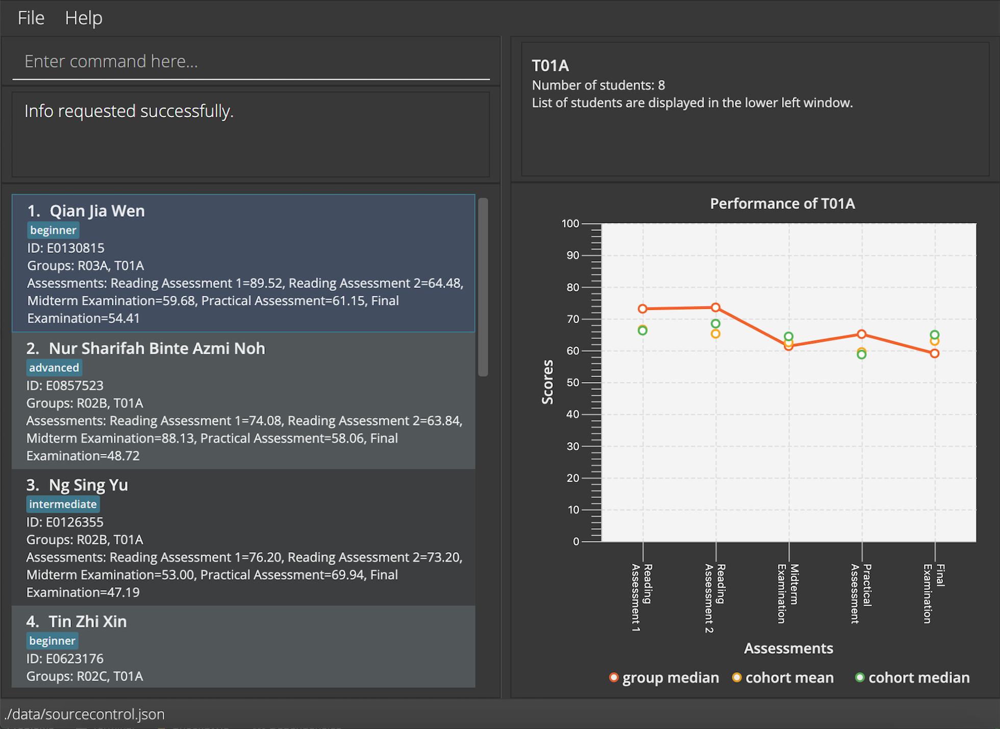

Source Control is a **desktop app for CS1101S professors to manage the performance of their students, optimized for use via a Command Line Interface** (CLI) while still having the benefits of a Graphical User Interface (GUI). Source Control can give you a quick overview or a closer look of how your students are doing.

* Table of Contents 
{:toc}

--------------------------------------------------------------------------------------------------------------------

## Quick start

1. Ensure you have Java `11` or above installed in your Computer.

1. Download the latest `addressbook.jar` from [here](https://github.com/AY2122S1-CS2103T-W08-2/tp/releases).

1. Copy the file to the folder you want to use as the _home folder_ for your AddressBook.

1. Double-click the file to start the app. The GUI similar to the below should appear in a few seconds. Note how the app contains some sample data. 
   

1. Type the command in the command box and press Enter to execute it. e.g. typing **`help`** and pressing Enter will open the help window. 
   Some example commands you can try:

    * **`add student`**`-n John Doe -i E0123456` : Adds a student named `John Doe` with NUSNET ID `E0123456` to the Address Book.

    * **`add group`**`-g T01A -n John Doe` : Adds a group called `T01A` and adds a student name `John Doe` into the group.

    * **`search`**`-n John Doe` : Searches for a student called `John Doe`.

    * **`clear`** : Deletes all contacts.

    * **`exit`** : Exits the app.

1. Refer to the [Features](#features) below for details of each command.

--------------------------------------------------------------------------------------------------------------------

## Features

v1.2 assumes that all inputs are valid, i.e. student id is in the correct format, and the groups which the student belongs to exists.

**:information_source: Notes about the command format:** 

* Words in `<angled brackets>` are the parameters to be supplied by the user. 
  e.g. in `add -n <student_name>`, `<student_name>` is a placeholder which can be used as `add -n John Doe`.

* Parameters in `(round brackets)` separated by `|` are mutually exclusive options for input. Only one input should to be supplied by the user. 
  e.g. `(-n <student_name> | -i <student_id> | -group <group_name>)` can be used as `-n John Doe`, or as `-i E0123456`, or as `-g T02A`

* Parameters in `[square brackets]` are optional.  
  e.g. `-n <student_name> [-g <group_name>]` can be used as `-n John Doe -g T01A`, or as `-n John Doe`.

* Items with `…​`  after them can be used multiple times including zero times. 
  e.g. `[-g <group_name>]…​` can be used as ` ` (i.e. 0 times), or `-g T01A -g R01A`.

* Parameters can be in any order. 
  e.g. if the command specifies `-n <student_name> -g <group_name>`, then `-g <group_name> -n <student_name>` is also acceptable.

* If a parameter is expected only once in the command but you specify it multiple times, only the last occurrence of the parameter will be taken. 
  e.g. if you specify `-g T02A -g T03B` and the command only expects one group, only `-g T03B` will be taken.

* Extraneous parameters for commands that do not take in parameters (such as `clear`) will be ignored. 
  e.g. if the command specifies `clear 123`, it will be interpreted as `clear`.

### Importing data: `import`

Loads data as specified in the provided CSV file.

Format: `import -f <file_path> -g <number_of_groups> -a <number_of_assessments>`

* The file path can be either the absolute path or the relative path.
* The first row of the CSV file needs to be headers for the respective columns.
* The first two columns refer to the student’s name and NUSNET ID.
* The next n columns, where n is the specified number of groups, refer to the student’s groups.
* The next m columns, where m is the specified number of assessments, refer to the student’s grade in the respective assessments.
* The header for the assessment rows should be in the following format: `<assessment_name>/<max_grade>`. For example, `Rune Trials/600`.
* Every row apart from the first represents a student.

:bulb: **Tips:** 

* If the student does not have as many groups as the number of groups, you should leave several group columns blank.

* If the student does not have a grade for some assessment, you should leave the corresponding assessment column blank.

Examples:
* `import -f /home/prof/CS1101S/student_data.csv -g 2 -a 10`
* `import -f student_data.csv -g 3 -a 30`

### Saving the data `[coming soon]`

_Details coming soon ..._

### Archiving data files `[coming soon]`

_Details coming soon ..._

--------------------------------------------------------------------------------------------------------------------

## FAQ `[coming soon]`

--------------------------------------------------------------------------------------------------------------------

## Command summary

Action | Format, Examples
--------|------------------
**Import data** | `import -f <file_path> -g <number_of_groups> -a <number_of_assessments>`   e.g. `import -f student_data.csv -g 3 -a 30`
